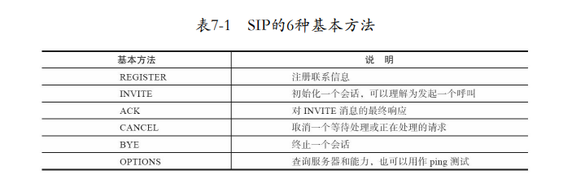

# SIP协议

## SIP协议基础
会话初始协议（`Session Initiation Protocol`）是一个控制发起、修改和终结交互式多媒体会话的信令协议。它是由`IETF`（`Internet Engineering Task Force`，Internet工程任务组）在RFC 2543中定义的，最早发布于1999年3月，后来在2002年6月又发布了一个新的标准 RFC 3261。除此之外，还有很多相关的或是在SIP基础上扩展出来的RFC，如关于SDP的RFC 4566、关于会议的RFC 4579等。

## HTTP与SIP协议基础
SIP是一个基于文本的协议，这一点与HTTP和SMTP类似。我们 来对比一组简单的HTTP请求与SIP请求。
```
HTTP: GET /index.html HTTP/1.1 
SIP:  INVITE sip:seven@freeswitch.org.cn SIP/2.0
```
两者类似，请求均有三部分组成：在`HTTP`请求中，`GET`指明一个获取资源（文件）的动作，`/index.html`则是资源的地址，最后 `HTTP/1.1`是协议版本号；而在`SIP`中，`INVITE`表示发起一次呼叫请求，`seven@freeswitch.org.cn`为请求的地址，也称为`SIP URI`或 `AOR`（`Adress of Record`，用户的公开地址），第三部分的`SIP/2.0`也是版本号。其中，`SIP URI`类似一个电子邮件地址，其格式为`“协议:名称@主机”`。这里`SIP URI`格式中的`“协议”`与`HTTP`和`HTTPS`相对应， 也有`SIP`和`SIPS`两种（后者是加密的，如`sips:seven@freeswitch.org.cn`）；“名称”可以是一串数字的电话号码，也可以是字母表示的名称；而“主机”可以是一个域名，也可以是一个`IP`地址。


```
  1 * Rebuilt URL to: localhost/
  2 * Hostname was NOT found in DNS cache
  3 *   Trying 127.0.0.1...
  4 * Connected to localhost (127.0.0.1) port 80 (#0)
  5 > GET / HTTP/1.1
  6 > User-Agent: curl/7.35.0
  7 > Host: localhost
  8 > Accept: */*
  9 >
 10 < HTTP/1.1 200 OK
 11 * Server nginx/1.4.6 (Ubuntu) is not blacklisted
 12 < Server: nginx/1.4.6 (Ubuntu)
 13 < Date: Sun, 15 Apr 2018 02:44:34 GMT
 14 < Content-Type: text/html
 15 < Content-Length: 612
 16 < Last-Modified: Tue, 04 Mar 2014 11:46:45 GMT
 17 < Connection: keep-alive
 18 < ETag: "5315bd25-264"
 19 < Accept-Ranges: bytes
 20 <
 21 <!DOCTYPE html>
 22 <html>
 23 <head>
 24 <title>Welcome to nginx!</title>
 25 <style>
 26     body {
 27         width: 35em;
 28         margin: 0 auto;
 29         font-family: Tahoma, Verdana, Arial, sans-serif;
 30     }
 31 </style>
 32 </head>
 33 <body>
 34 <h1>Welcome to nginx!</h1>
 35 <p>If you see this page, the nginx web server is successfully installed and
 36 working. Further configuration is required.</p>
 37 
 38 <p>For online documentation and support please refer to
 39 <a href="http://nginx.org/">nginx.org</a>.<br/>
 40 Commercial support is available at
 41 <a href="http://nginx.com/">nginx.com</a>.</p>
 42 
 43 <p><em>Thank you for using nginx.</em></p>
 44 </body>
 45 </html>
 46 * Connection #0 to host localhost left intact
 47 

```
以`“*”`开头的都是CURL的调试信息，以`“>”`开头的行是客户端向服务器发出的请求，以`“<”`开头的行是服务器对客户端的响应。

## SIP的基本概念和相关元素
`SIP`是一个`对等`的协议，类似`P2P`。它和`HTTP`不一样，其不是客户端服务器结构的；也不像传统电话那样必须有一个中心的交换机，它可以在不需要服务器的情况下进行通信，只要通信双方都彼此知道对方地址（或者只有一方知道另一方的地址）即可，这种情况称为`点对点通信`。如图7-1所示，Bob给Alice发送一个`INVITE`请求，说“Hi,一起吃饭吧…”，Alice说“好的，OK”，电话就接通了。


在`SIP`网络中，Alice和Bob都称为用户代理（`User Agent`，`UA`）。`UA`是在`SIP`网络中发起或响应`SIP`处理的逻辑实体。`UA`是有状态的，也就是说，它维护会话（或称对话）的状态。`UA`有两种：一种是`UAC`（`UA Client`），它是发起`SIP`请求的一方，比如图7-1中的Bob；另一种是`UAS`（`UA Server`），它是接受请求并发送响应的一方，比如图7-1中的Alice。由于`SIP`是对等的，当Alice呼叫Bob时，Alice就称为UAC，而Bob则实现UAS的功能。一般来说，UA都会实现上述两种功能。

- 代理服务器（Proxy Server）
- 重定向服务器（Redirect Server）
- 注册服务器
- 背靠背用户代理（Back-to-Back UA，B2BUA）


- 边界会话控制器（Session Border Controller，SBC）。


## SIP协议的基本方法和头域简介
### 基本方法


#### 头域


## SIP注册