# 开始测试使用
强烈建议在统一的局域网下进行配置，通信

本机IP:`192.168.1.155`

## 架构
`freeSWITCH`搭建在以`Windows`平台作为通信服务器。`fs_cli`为服务器上测试客户端。
`X-lite`客户端程序搭建在`Windows`和`Mac`平台。
`zoiper配置`客户端搭建在`Android平台`,测试不同平台上的通信。

## Windows
### freeSWITCH
- 以管理员权限运行`freeSWITCH`服务端`C:\Program Files\FreeSWITCH\FreeSwitchConsole.exe`
> 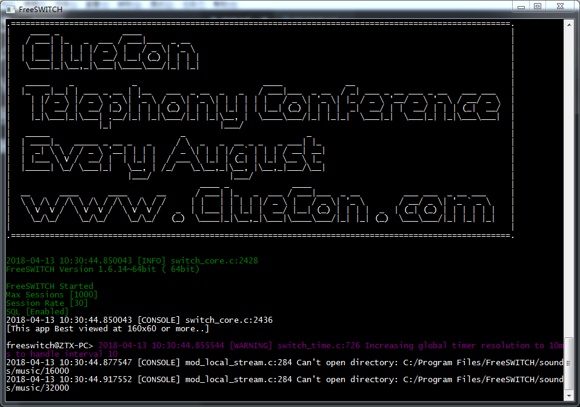

- 运行客户端软件 `C:\Program Files\FreeSWITCH\fs_cli.exe`
> 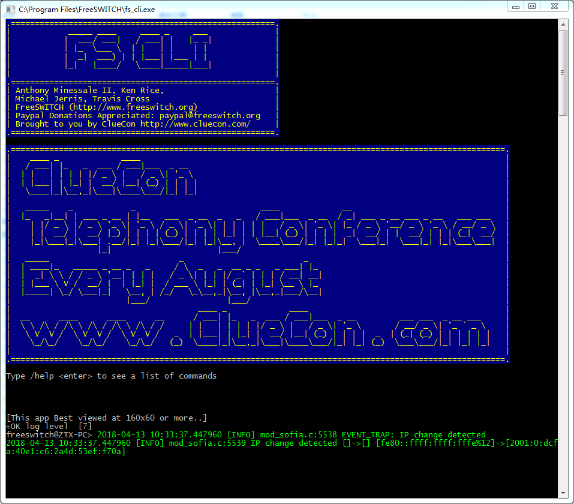

### X-lite
运行`X-lite`
#### Windows
> 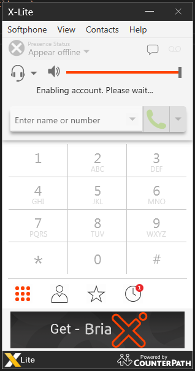

#### Mac
> 

## 配置
### IP和端口
通过输入以下命令可以知道 FreeSWITCH 监听在哪个IP地址上，记住这个 IP 地址(:5060以前的部分)，下面要用到：
```
$ netstat -an | grep 5060
  TCP    192.168.1.155:5060     0.0.0.0:0              LISTENING
  UDP    192.168.1.155:5060     *:*
```

#### Windows X-lite配置
FreeSWITCH 默认配置了 `1000 ~ 1019` 共 `20` 个用户，你可以随便选择一个用户进行配置：
在 `X-Lite` 上点右键，选 `Sip Account Settings...`，点`Add`添加一个账号，填入以下参数(Zoiper 可参照配置)：
```
Display Name: 1000
User name: 1000
Password: 1234
Authorization user name: 1000
Domain: 你的IP地址，就是刚才你记住的那个
```
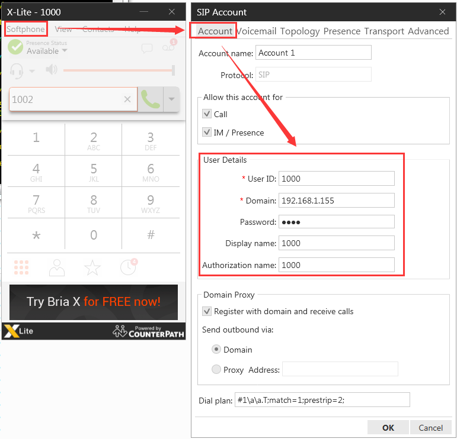

其它都使用默认设置，点 `OK` 就可以了。然后点 `Close` 关闭 `Sip Account` 设置窗口。这时` X-Lite` 将自动向 `FreeSWITCH` 注册。注册成功后会显示`"Ready. Your username is 1000"`，另外，左侧的"拨打电话"(`Dial`)按钮会变成绿色的。


---

#### Mac X-lite配置
同理配置`Mac`上的`X-lite`


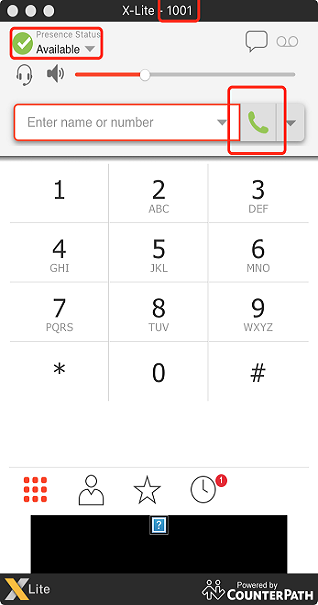

---

#### Android zoiper配置

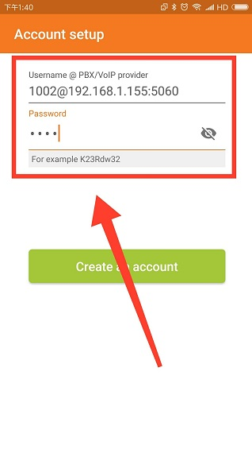
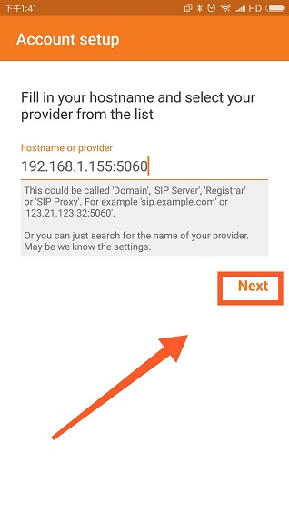

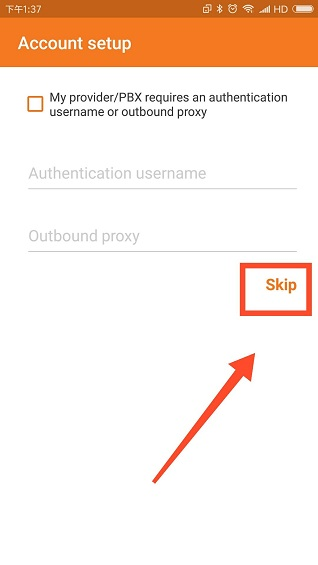


---

#### 号码说明
```
9999 | 保持音乐
9996 | echo，回音测试 
9992 | info，在控制台上显示呼叫参数
9888 | FreeSWITCH电话会议，每周召开
5900 | 呼叫挂起
5901 | 接听挂起的呼叫
5000 | 示例IVR
4000 | 听取语音信箱
33xx | 电话会议，48K(其中xx可为00-99，下同)
32xx | 电话会议，32K
31xx | 电话会议，16K
30xx | 电话会议，8K
2000-2002 | 呼叫组
1000-1019 | 默认分机号
```

## 通信
- Windows X-lite 为 `1000`
- Mac X-lite 为 `1001`
- Android zoiper 为 `1002`
### 1000 --> 1001
#### 拨号

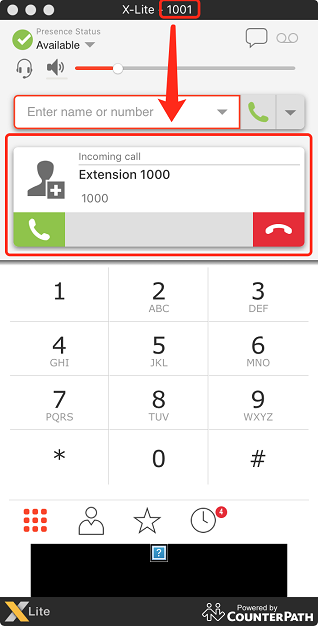

#### 接通
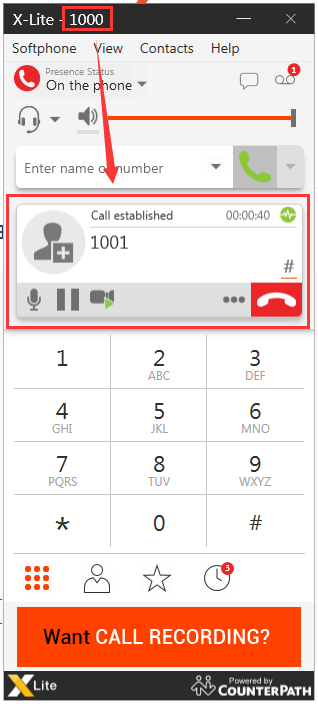
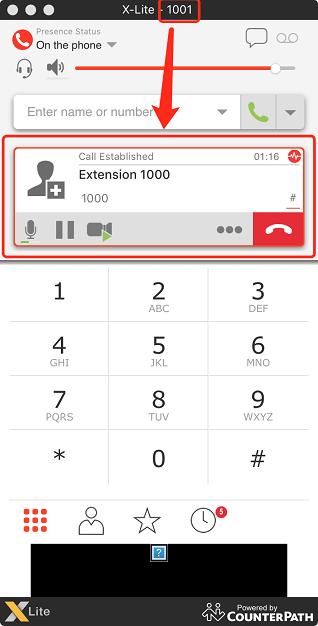

#### 挂断
退出接通界面，返回正常界面

### 1000 --> 1002
#### 拨号
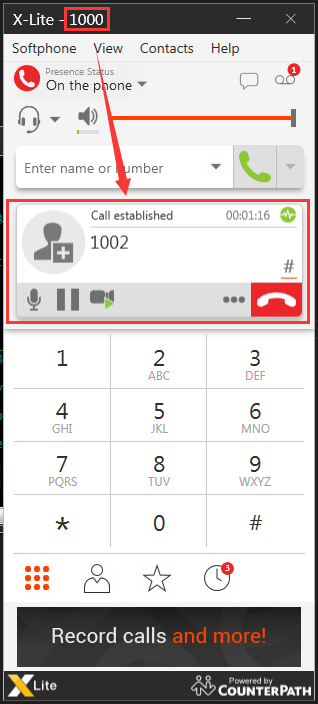
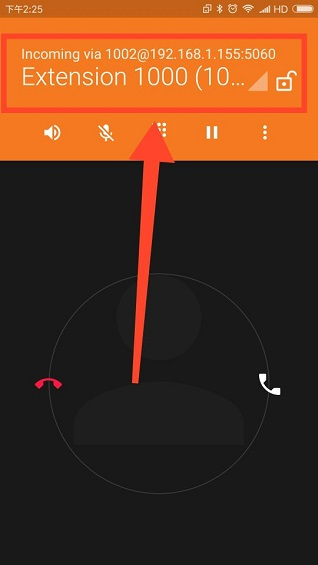

#### 接通
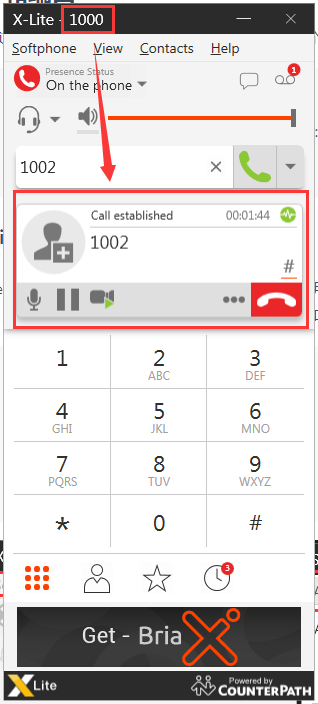


#### 挂断
退出接通界面，返回正常界面

### 1001 --> 1002
略


## 注意
### `freeswitch`默认密码修改
修改`FreeSWITCH\conf\var.xml`为如下
```xml
    <X-PRE-PROCESS cmd="set" data="default_password=your password"/>
```
### `freeswitch`在多网卡服务器下如何指定`IP`地址

修改`FreeSWITCH\conf\var.xml`，添加`local_ip_v4=your ip`覆盖默认值
```xml
<X-PRE-PROCESS cmd="set" data="local_ip_v4=your ip"/>
```

或修改`FreeSWITCH\conf\sip_profiles\internal.xml` 
```xml
    <!-- ip address to use for rtp, DO NOT USE HOSTNAMES ONLY IP ADDRESSES -->
    <param name="rtp-ip" value="$${local_ip_v4}"/>
    <!-- ip address to bind to, DO NOT USE HOSTNAMES ONLY IP ADDRESSES -->
    <param name="sip-ip" value="$${local_ip_v4}"/>
```
修改为

```XML
    <!-- ip address to use for rtp, DO NOT USE HOSTNAMES ONLY IP ADDRESSES -->
    <param name="rtp-ip" value="your ip"/>
    <!-- ip address to bind to, DO NOT USE HOSTNAMES ONLY IP ADDRESSES -->
    <param name="sip-ip" value="your ip"/>
```

#### `FreeSWITCH\conf\autoload_configs\sofia.conf.xml`修改
修改为如下，该属性设置的目的是防止FS在检测到IP地址发生改变后，自动重启sofia模块。
```xml
    <param name="auto-restart" value="false"/>
```

重启`FreeSWITCH`，开始测试。